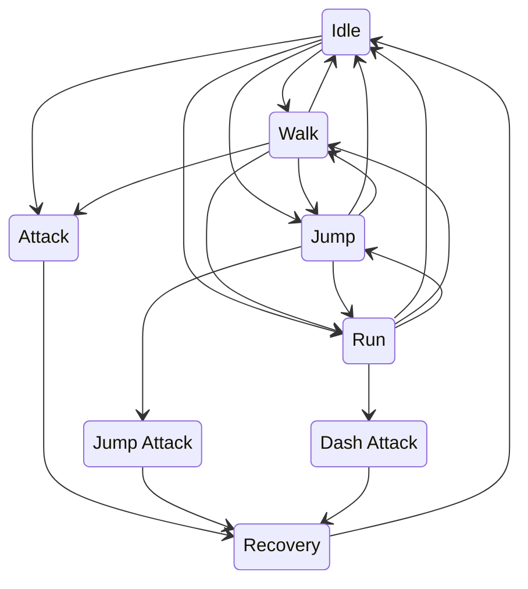
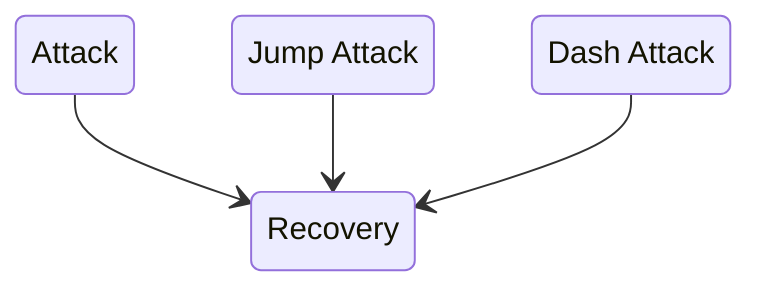
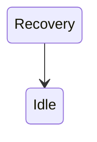

# Player State Machine

The player has multiple states that control the player's animation and velocity.\
\
The attack states also check for hits, and move to the recovery state.

The recovery state prevents input for a short time, then moves to the idle state.

