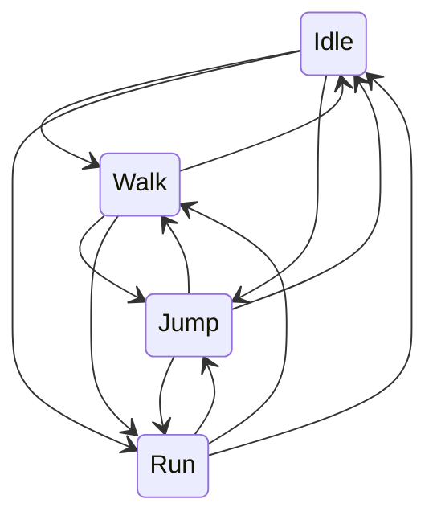

# Player State Machine

##The player has multiple states that control the player's animation and velocity.\
\
##The player can transition freely between idle, walking, running, and jumping.

##The attack states also check for hits, and move to the recovery state.

##The recovery state prevents input for a short time, then moves to the idle state.

